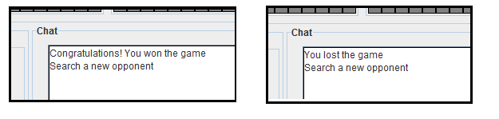

Battleship RMI Game
===================

  

##About
Implement the Battleship Game using RMI as communication.

Start the game the user enter the name and port of your server.

  
 

  
 

The user can start game accessing the menu Options, a window appears for the user enter the name server opponents.

  

Each player can play three times in a game. When the player hits an opponent's piece this piece change color for red, if you miss the 
opponent's piece this piece change color for blue. Each movement was a message informing that the piece was hit, is also informed if 
the arm was sunk.

  
 

When a player wins the game a popup informs that he won the match, a popup also informs the loser that he lost the match.

  

##Download
You can download it in the .jar format:  
[last version](https://raw.github.com/marcuspimenta/Battleship-RMI-Game/master/build/battleship-rmi.jar)

##Author
Marcus Vinícius Pimenta  
email: [mvinicius.pimenta@gmail.com](mailto:mvinicius.pimenta@gmail.com)